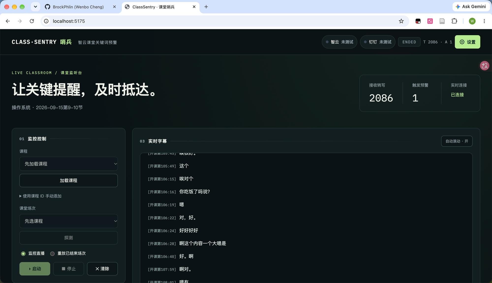
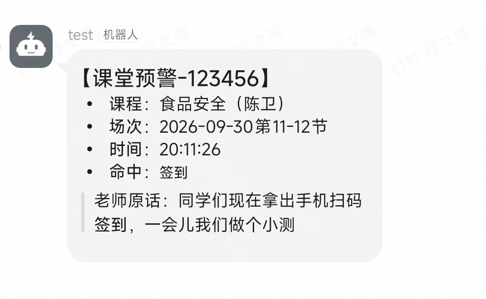
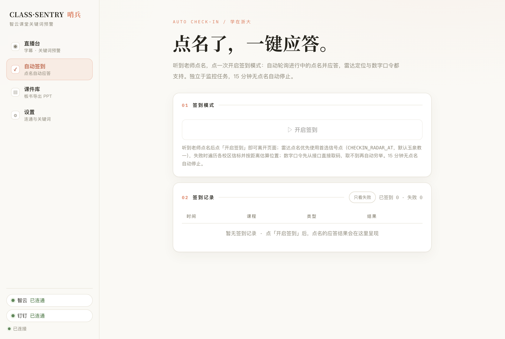
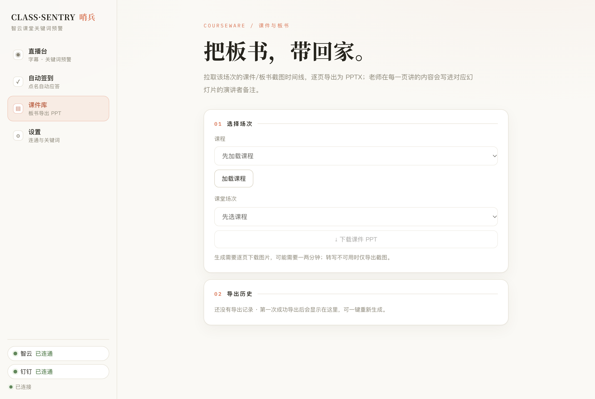
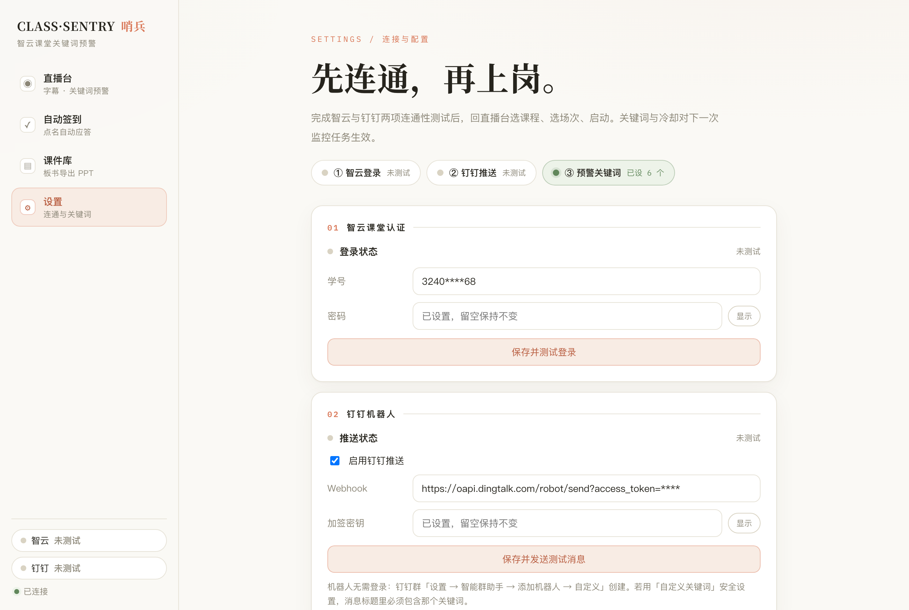

# ClassSentry · 课堂哨兵

智云课堂直播的「听讲哨兵」：监听平台实时语音识别，老师说到「签到 / 小测 / 扫码」等关键词时，钉钉机器人秒级推送预警，网页控制台同步滚动实时字幕。



钉钉收到的预警长这样：



## 原理

- **认证与数据**：[login-zju](https://www.npmjs.com/package/login-zju)（统一身份认证）+ 智云课堂接口（课程 / 场次 / 直播探测）
- **实时语音**：直连平台直播字幕的 glue WebSocket（与官方网页同源同延迟，协议逆向自官方前端）；无实时通道时自动降级轮询转写接口
- **推送**：钉钉自定义机器人 webhook（加签 / 自定义关键词模式均可）
- **误报复核（可选）**：命中关键词后先让 Claude 判断是否真的在号召（`.env` 开 `LLM_REVIEW` + `ANTHROPIC_API_KEY`），判定误报不推送，复核失败自动放行
- **自动签到**：复用同一凭据经 CAS 登录学在浙大（courses.zju.edu.cn），自动应答进行中的点名——雷达定位签到（内置各校区信标坐标，失败时按返回距离做球面最小二乘定位）与数字口令签到（先取码直提，再 0000–9999 兜底）
- **课件导出**：拉取该场次的课件/板书截图时间线 + 转写讲稿，本地生成 PPTX（每页截图一张幻灯片，对应时段的讲稿写入演讲者备注）
- **界面**：Express + 原生 JS 单页（SSE 实时推送），仅绑定 `127.0.0.1`

## 使用

```bash
npm install
cp .env.example .env    # 填学号密码与钉钉机器人
npm start               # 打开 http://127.0.0.1:5175
```

## 桌面应用（macOS）

不需要浏览器，也不需要任何服务器：`npm run app:build` 会把本地服务整体打包进 app（`release/` 下生成 `ClassSentry.app` 与 `.dmg`）。

- app 内嵌同一套控制台，数据（`.env` / `alerts.json`）存放在 `~/Library/Application Support/ClassSentry/`
- 关闭窗口不退出，监控继续；`Cmd+Q` 才真正停止
- 若 5175 已有 `node server.js` 在跑，app 会直接复用它而不是重复启动
- 首次以未签名应用运行如被 Gatekeeper 拦下：右键 →「打开」，或 `xattr -cr /Applications/ClassSentry.app`

「设置」页完成智云与钉钉两项连通性测试 → 直播台选课程、选场次 → **启动**。
关键词、冷却均可配，关键词支持中英文逗号（`.env.example` 有完整说明）。

控制台按功能分页，左侧导航切换：**直播台**（监控控制 / 实时字幕 / 告警历史）、**自动签到**（学在浙大点名应答）、**课件库**（板书导出 PPT）、**设置**（连通性 / 关键词 / 高级选项）。

| 自动签到 | 课件库 | 设置 |
| --- | --- | --- |
|  |  |  |

直播台显示运行时长与监听通道，字幕可一键复制或导出 TXT，告警历史支持按关键词、文本与推送状态筛选；浏览旧字幕时会暂停自动滚动，点击「自动滚动」恢复跟随；清除任务会清空字幕与任务状态，告警历史继续保留。连通性测试结果由服务端记录、跨页面保持一致，修改对应配置后自动失效（重启服务后需重新测试）；正在运行的任务仍可查看字幕。

听到点名预警后，可点「▷ 自动签到」开启签到模式：自动轮询学在浙大进行中的点名并应答（雷达 / 数字口令），结果实时显示在「自动签到记录」。签到独立于监控任务，15 分钟无点名自动停止，也可随时手动停止。默认首选玉泉教一信号点，可通过 `.env` 里 `CHECKIN_RADAR_AT` 换成其他信标。

选择场次后点「⤓ 下载课件 PPT」，会把该场次的课件/板书截图逐页导出为 PPTX，老师在每一页讲的内容写入对应幻灯片的演讲者备注（转写不可用时仅导出截图）。生成需要逐页下载图片，可能需要一两分钟。导出成功后会在「导出历史」留下记录，可一键重新生成；上次选过的课程与场次会自动记住。

CLI 仍可用：`node index.js`（监控）· `node index.js replay`（重放验证）· `node index.js test-ding`。

## 已知局限

- 需要老师端开启了平台的实时语音识别
- 半句即报可能有同音误报（「请到」→「签到」），可开 `ALERT_ON_FINAL_ONLY`
- 钉钉限流 20 条/分钟，工具用每词冷却（默认 120s）压频

## 免责声明

仅供学习交流，遵守浙江大学相关规定，勿用于商业或违规用途。

## 开发验证

运行 `npm test` 执行前端交互与监听器回归测试。测试使用模拟接口，不会登录智云、学在浙大或发送钉钉消息。
